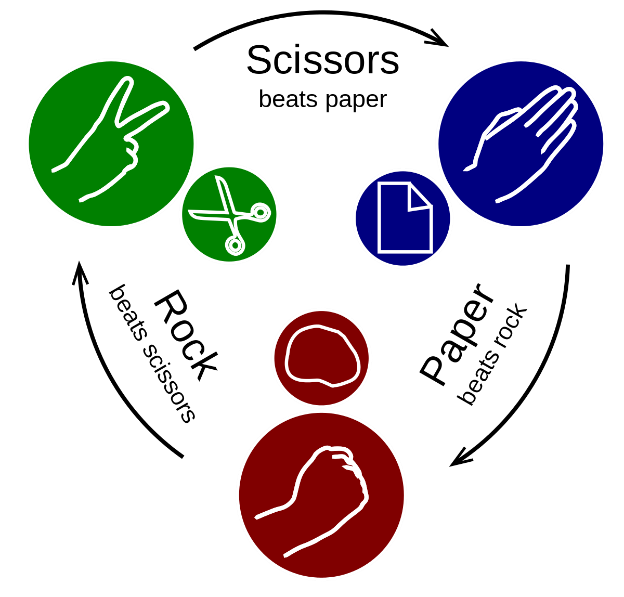
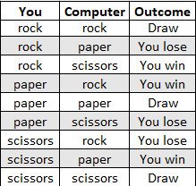
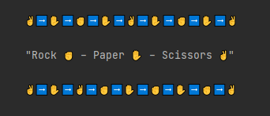
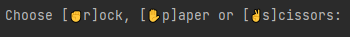
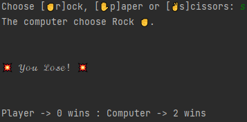
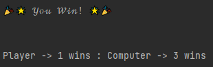

# Rock ✊ – Paper ✋ – Scissors ✌️ 

# Project goals
This is a simple console game!
The game is a part of educational project on **SoftUni** course and implemented as a challenge.

# Solution 
The game uses the `random` library and the `randint` function.
The computer's moves are randomized, and the player chooses them himself.
# Rules

# Source code link
Start Game form this file:

`player_move.py`

Then make your choice by entering one of the indicated symbols:

and finally see the result of the game

After each game, the statistics of the players' victories are also written.

